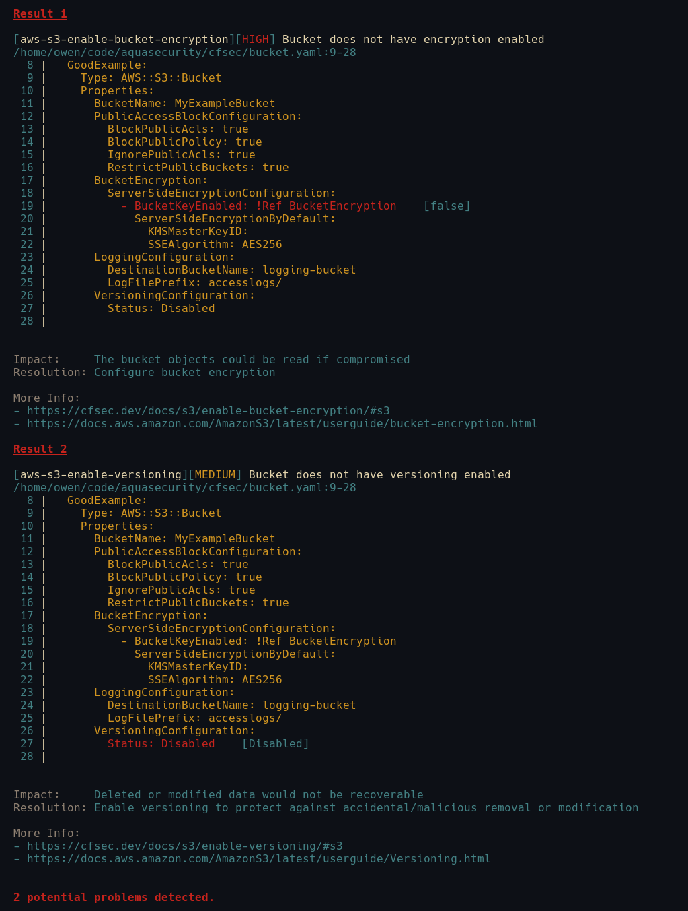

Hot on the heels of [tfsec](https://tfsec.dev), we have been working on [cfsec](https://cfsec.dev) for scanning your CloudFormation templates. `cfsec` will scan both `yaml` and `json` template files and gives you the same rich information about any issues that it finds.

## The Example File

For this whirlwind tour of `cfsec` I'm going to be using the following basic CloudFormation stack to create a new bucket.

```yaml
---
AWSTemplateFormatVersion: "2010-09-09"
Description: An example template
Parameters:
  BucketEncryption:
    Type: Boolean
    Default: false
Resources:
  GoodExample:
    Type: AWS::S3::Bucket
    Properties:
      BucketName: MyExampleBucket
      PublicAccessBlockConfiguration:
        BlockPublicAcls: true
        BlockPublicPolicy: true
        IgnorePublicAcls: true
        RestrictPublicBuckets: true
      BucketEncryption:
        ServerSideEncryptionConfiguration:
          - BucketKeyEnabled: !Ref BucketEncryption
            ServerSideEncryptionByDefault:
              KMSMasterKeyID: 
              SSEAlgorithm: AES256
      LoggingConfiguration:
        DestinationBucketName: logging-bucket
        LogFilePrefix: accesslogs/
      VersioningConfiguration:
        Status: Disabled
```

This configuration will create us a new `S3 Bucket` called `MyExampleBucket`. I think I'm happy with it, public access block configuration has been turned on and we're logging access so all should be okay.

## Next Steps

The next step is to run this through `cfsec` and see if it finds any misconfigurations

### Running cfsec

There are a number of ways that we can run cfsec, we can [install locally](https://cfsec.dev/docs/installation/) or if we're running in CI or have Docker installed, it might be more convenient to use the Docker image.

**Running locally**

To run locally we can do 

```bash
cfsec bucket.yaml
```

**Running in Docker**

```bash
docker run --rm -v `pwd`:/src aquasec/cfsec /src
```

### The results

However we've chosen to run it, we'll get the same results. It looks like I've missed two issues 



There is a `Medium` issue with Versioning not being enabled and there is a `High` issue where I have forgotten to enable encryption.

## Fix and rerun

If I fix the issues...
```yaml
---
AWSTemplateFormatVersion: "2010-09-09"
Description: An example template
Parameters:
  BucketEncryption:
    Type: Boolean
    Default: true
Resources:
  GoodExample:
    Type: AWS::S3::Bucket
    Properties:
      BucketName: MyExampleBucket
      PublicAccessBlockConfiguration:
        BlockPublicAcls: true
        BlockPublicPolicy: true
        IgnorePublicAcls: true
        RestrictPublicBuckets: true
      BucketEncryption:
        ServerSideEncryptionConfiguration:
          - BucketKeyEnabled: !Ref BucketEncryption
            ServerSideEncryptionByDefault:
              KMSMasterKeyID: 
              SSEAlgorithm: AES256
      LoggingConfiguration:
        DestinationBucketName: logging-bucket
        LogFilePrefix: accesslogs/
      VersioningConfiguration:
        Status: Enabled
```

Now we get the result

```bash
  0 potential problems detected.
```

## Whats next?

I'll be adding more posts about using the more advanced features of cfsec an the additional tools to support it in the coming weeks.