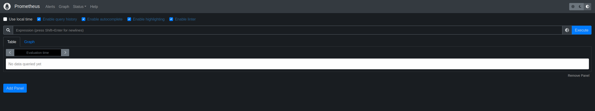
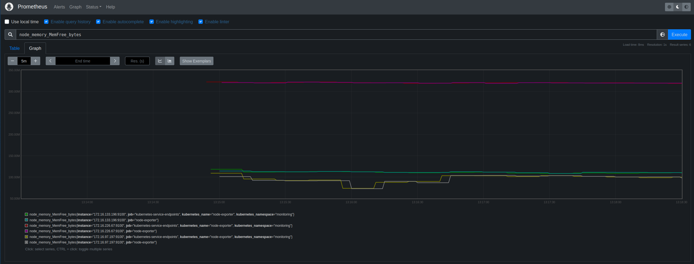

## What is this about?

This blog post is kind of a learning in public exercise. The goal is to run Prometheus in my local K8s cluster and export Node metrics to it.

I'm using a cluster generated by [my local_k8s](https://github.com/owenrumney/local_k8s) project. Out of the box, this creates KVM hosted cluster on an Arch machine with an underlying NFS ready for Persisted Volumes; PRs and Issues welcome.

## Creating the namespace

The first thing we want to do is create a namespace to run the monitoring resources in. I'm going to call this `monitoring`

```console
kubectl create namespace monitoring
```

This is the logical grouping for all the resources related to monitoring to be placed, this will be the Pods, ConfigMaps, Services, Secrets etc

## Access Control

This first section will configure the access control for a service account to run Prometheus for us.

### Service Account

I want to run monitoring as its own dedicated service account, so lets create the manifest file for that.

```yml
# monitor-sa.yaml

apiVersion: v1
kind: ServiceAccount
metadata:
  name: monitor
  namespace: monitoring
```

This will create a service account in the `monitoring` namespace called `monitor`.

Create:
```console
kubectl create -f monitor-sa.yaml
```

### Cluster role

Now that we have a service account, we need to give some permissions to it. Using the Role Based Access Control (RBAC) for Kubernetes, this requires a dedicated role for the access that is required.

Our service account in the `monitoring` namespace needs to be able to access resources across the cluster, so this needs to be a `ClusterRole`.

```yaml
# monitor-cluster-role.yaml

apiVersion: rbac.authorization.k8s.io/v1
kind: ClusterRole
metadata:
  name: monitor
rules:
- apiGroups: [""]
  resources:
  - nodes
  - services
  - endpoints
  - pods
  verbs: ["get", "list", "watch"]
```

This `ClusterRole` grants holders of the role to be able to `get`, `list` and `watch` a selection of resources (`nodes`, `services`, `endpoints` and `pods`). 

Create:
```console
kubectl create -f monitor-cluster-role.yaml
```

### Binding

There is nothing linking our `monitor` service account to the `monitor` role at the moment, for this we need a `ClusterRoleBinding`.

```yaml
# monitor-cluster-role-binding.yaml

apiVersion: rbac.authorization.k8s.io/v1
kind: ClusterRoleBinding
metadata:
  name: monitor
roleRef:
  apiGroup: rbac.authorization.k8s.io
  kind: ClusterRole
  name: monitor
subjects:
- kind: ServiceAccount
  name: monitor
  namespace: monitoring
```

This manifest is binding the `ClusterRole` `monitor` to the service account `monitor` from the `monitoring` namespace.

Create:
```console
kubectl create -f monitor-cluster-role-binding.yaml
```

### Validating Access

At this stage, we want to verify that our new service account can do what we've set in the permissions. To do this, we can use the `auth can-i` command provided by `kubectl`

```console
kubectl auth can-i watch pods --as system:serviceaccount:monitoring:monitor
```

This command checks if the service account `monitor` in the `monitoring` namespace can `watch (verb)` `pods (resource)`. Thankfully the answer is an emphatic `yes`

## Deploying Prometheus

In this section I will cover the actual deployment of Prometheus

### Configuration

Lets store the configuration for Prometheus in a config map. As everything is running in the `monitoring` namespace, we can create the config map there.

We need a config to put in the map, this configures the scrapes that Prometheus will perform and some additional global settings.

```yaml
#prometheus.yml 

global:
  scrape_interval: 15s # scrape every 15 seconds
  external_labels:
    monitor: 'cluster'

scrape_configs:
- job_name: 'prometheus'
  scrape_interval: 5s
  static_configs:
  - targets: ['localhost:9090']
- job_name: 'kubernetes-service-endpoints'
  kubernetes_sd_configs:
  - role: endpoints
  relabel_configs:
  - action: labelmap
    regex: __meta_kubernetes_service_label_(.+)
  - source_labels: [__meta_kubernetes_namespace]
    action: replace
    target_label: kubernetes_namespace
  - source_labels: [__meta_kubernetes_service_name]
    action: replace
    target_label: kubernetes_name
```

Create: (pay attention to creating in correct namespace)

```console
kubectl -n monitoring create configmap prometheus-config --from-file prometheus.yml
```

### Deployment

I'm going to deploy as a single replica for this example and use a `Deployment` rather than just a `Pod` so that any restarts are handled nicely.

```yaml
# prometheus-deployment.yaml

apiVersion: apps/v1
kind: Deployment
metadata:
  name: prometheus
  namespace: monitoring
spec:
  replicas: 1
  selector:
    matchLabels:
      app: prometheus
  template:
    metadata:
      labels:
        app: prometheus
    spec:
      containers:
      - name: prometheus
        image: prom/prometheus
        volumeMounts:
        - name: config-volume
          mountPath: /etc/prometheus/prometheus.yml
          subPath: prometheus.yml
        ports:
        - containerPort: 9090
      volumes:
      - name: config-volume
        configMap:
          name: prometheus-config
      serviceAccountName: monitor
```

Create:
```console
kubectl create -f prometheus-deployment.yaml
```

### Service

Now we have the Prometheus pods running, we need a service to actually get to the UI from our browser.

```yaml
# prometheus-service.yaml

kind: Service
apiVersion: v1
metadata:
  name: prometheus
  namespace: monitoring
spec:
  selector:
    app: prometheus
  ports:
  - name: promui
    nodePort: 39090
    protocol: TCP
    port: 9090
    targetPort: 9090
  type: NodePort
```

### Viewing Prometheus

To view the dashboard lets open up Prometheus with a simple port forward, (an ingress would be better, but this is quicker)

First, find the name of the pod
```console
kubectl get pods -n monitoring
```

Making a note of the Pod name, we can create a port forward

```console
kubectl port-forward -n monitoring prometheus-deployment-6559cbc88b-9m9hv 8080:9090
```

Now if we browse to `http://localhost:8080` we can see the Prometheus dashboard.




## Node Exporter

There are a few more steps to see the Node Exporter metrics

### Adding Exporter Pod

We need a pod per node to get the metrics, so the clear choice is deploying as a `DaemonSet`. These pods will run in the `monitoring` namespace.

```yaml
# node-exporter-daemonset.yaml

apiVersion: apps/v1
kind: DaemonSet
metadata:
  labels:
    app.kubernetes.io/component: exporter
    app.kubernetes.io/name: node-exporter
  name: node-exporter
  namespace: monitoring
spec:
  selector:
    matchLabels:
      app.kubernetes.io/component: exporter
      app.kubernetes.io/name: node-exporter
  template:
    metadata:
      labels:
        app.kubernetes.io/component: exporter
        app.kubernetes.io/name: node-exporter
    spec:
      containers:
      - args:
        - --path.sysfs=/host/sys
        - --path.rootfs=/host/root
        - --no-collector.wifi
        - --no-collector.hwmon
        - --collector.filesystem.ignored-mount-points=^/(dev|proc|sys|var/lib/docker/.+|var/lib/kubelet/pods/.+)($|/)
        - --collector.netclass.ignored-devices=^(veth.*)$
        name: node-exporter
        image: prom/node-exporter
        ports:
          - containerPort: 9100
            protocol: TCP
        volumeMounts:
        - mountPath: /host/sys
          mountPropagation: HostToContainer
          name: sys
          readOnly: true
        - mountPath: /host/root
          mountPropagation: HostToContainer
          name: root
          readOnly: true
      volumes:
      - hostPath:
          path: /sys
        name: sys
      - hostPath:
          path: /
        name: root
```

Note that we're mounting `sys` and `root` from the host to be able to read from the host.

Create:
```console
kubectl create -f node-exporter-daemonset.yaml
```

### Node Exporter

For the metrics to be surfaced we need a service for the node-exporter. Again this will be running in the `monitoring` namespace.

```yaml
# node-exporter-service.yaml

kind: Service
apiVersion: v1
metadata:
  name: node-exporter
  namespace: monitoring
  annotations:
      prometheus.io/scrape: 'true'
      prometheus.io/port:   '9100'
spec:
  selector:
      app.kubernetes.io/component: exporter
      app.kubernetes.io/name: node-exporter
  ports:
  - name: node-exporter
    protocol: TCP
    port: 9100
    targetPort: 9100
```
*node-exporter-service.yaml*


### Adding a scrape job

The last thing left, we need to add a job to `prometheus.yml` and update the config map.

```yaml
- job_name: 'node-exporter'
  kubernetes_sd_configs:
  - role: endpoints
  relabel_configs:
  - source_labels: [__meta_kubernetes_endpoints_name]
    regex: 'node-exporter'
    action: keep
```

This adds a job that will look for node exporter metrics.

### Checking the end result

Now we can create the port forward again

```console
kubectl port-forward -n monitoring prometheus-deployment-6559cbc88b-94dsf 8080:9090
```

We can see a number of metrics now in the metrics explorer. Try adding the expression `node_memory_MemFree_bytes` and pressing `Execute` button. 

Over a period of time, this will give you a graph of free memory for the nodes in your cluster.

[](../image/../images/prometheus_node_exporter.png){:target="_blank"}