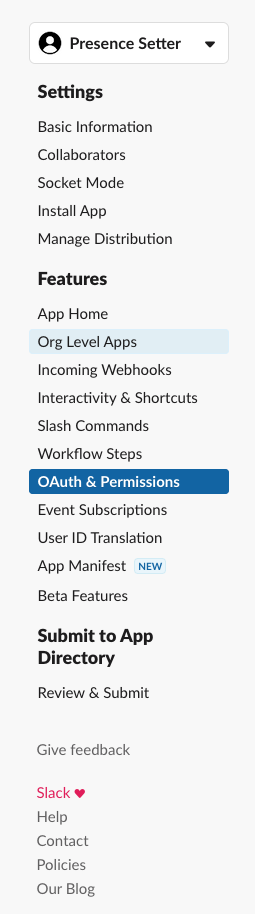
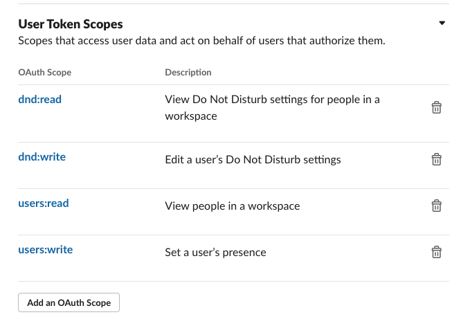

# The Brief

| Note: I am on week two of running a HomeAssistant service so I'm still learning. If you have any suggestions or improvements please let me know.

I want to be able to set my Slack presence when I'm working and "Away" when I'm not. I want this to be automated so I don't have to remember to do it and I want the notifications muted when I'm not working.

# The Solution

## Previous Solution

The previous solution (which worked) was a Lambda running in AWS that was triggered by an EventBridge schedule to change my status at the required times. This worked but it was a bit of a pain to maintain and I wanted to move it to something that was a bit more "local" to me.

## Home Assistant

I've been running Home Assistant for a few weeks now and I'm enjoying it. I've got a few automations set up and I'm slowly adding more. I've got a few smart plugs and lights that were previously controlled by Alexa and ported over to HA with very little pain.

## Steps

The following steps are required to achieve this

1. Create a Slack App
2. Create a Slack Token
3. Create and add a custom component to Home Assistant
4. Set up the automation

### Create a Slack App

Go to the [Apps Management Console](https://api.slack.com/apps/){:target="\_blank"} and click on "Create New App". Give it a name and select the workspace you want to use it in.

### Create a Slack Token

Go to the `OAuth & Permissions` section and scroll down to the `Scopes` section. Add the following scopes:



Set the scopes to the following;



Scroll back up, install to workspace and make a note of the token that is generated... it will start `xoxp-`

The api can be added to the `secrets.yaml` file in Home Assistant under `api_key` for use later.

### Create and add a custom component to Home Assistant

Setting up a custom component so that it is available as a service in HA is fairly easy. The [documentation](https://developers.home-assistant.io/docs/dev_101_services){:target="\_blank"} is pretty good and there are plenty of examples to follow.

The first thing you need is to create a folder in your `config` directory called `custom_components`. This is where you will put your custom components.
Next, you need to create a folder for your component. In my case, I created a folder called `slack_presence_setter` and inside that folder, I created a file called `__init__.py` and the `manifest.json`. This is the file that will be loaded by HA when it starts up.

The manifest describes a custom component, the domain must match the name of the folder you've created.

```json
{
  "domain": "slack_presence_setter",
  "name": "Slack Presence Setter",
  "version": "0.1.0",
  "iot_class": "local_push"
}
```

We then need some code that will run when the service is called.

```python
import sys
import urllib3
import os
import logging
import datetime


logger = logging.getLogger(__name__)
logger.setLevel(logging.INFO)


def setup(hass, config):
    """Set up the Slack presence setter component."""

    def update_snooze(api_key, http, snooze_enabled):
        """ Update the snooze status """
        if snooze_enabled:
            r = http.request("GET", f"https://slack.com/api/dnd.setSnooze?num_minutes=6120",
                             headers={"Authorization": "Bearer " + api_key})
            logger.info(f"Setting snooze for a long time")
            if r.status != 200:
                logger.error(f"Failed to set snooze")
        else:
            r = http.request("GET", f"https://slack.com/api/dnd.endDnd",
                             headers={"Authorization": "Bearer " + api_key})
            logger.info(f"Ending snooze")
            if r.status != 200:
                logger.error(f"Failed to end snooze")


    def update_status(api_key, http, new_presence):
        """ Update the presence """
        r = http.request("POST", f"https://slack.com/api/users.setPresence?presence={new_presence}",
                         headers={"Authorization": "Bearer " + api_key})
        logger.info(f"Setting status to {new_presence}")
        if r.status != 200:
            logger.error(f"Failed to set the status to {new_presence}")

        current_time = datetime.datetime.now().time()
        name = "presence_setter"
        logger.info("Cron execution " + name + " ran at " + str(current_time))


    def handle_event(call):
        http = urllib3.PoolManager()

        status = call.data.get("status", "away")
        api_key = call.data.get("api_key", None)

        if not api_key:
            logger.error("No api key available in the call data")
            return

        if status == "here":
            update_status(api_key, http, "auto")
            update_snooze(api_key, http, False)
        elif status == "away":
            update_status(api_key, http, "away")
            update_snooze(api_key, http, True)

    hass.services.register("slack_presence_setter",
                           "set_presence", handle_event)

    return True

```

Breaking this down;

1. We have the outer function `setup` that is called by HA when it loads the component. This function registers the service `set_presence` with HA. This function must return `True` to tell Home Assistant that the component loaded successfully.

2. The `handle_event` function is called when the service is called. It takes the `call` object as a parameter. This object contains the data that was passed to the service. In this case, it contains the `status` and `api_key` that we need to update the Slack status.

3. The `update_status` function takes the `api_key` and `http` objects and uses them to call the Slack API to update the status. It takes the `new_presence` as a parameter which is the status we want to set.
   When sending the presence status, the relevant choices are `auto` for on and `away` for .... away.

4. The `update_snooze` function takes the `api_key` and `http` objects and uses them to call the Slack API to update the snooze status. It takes the `snooze_enabled` as a parameter which is a boolean that tells us if we want to snooze or not.
   When snoozing, the relevant choices are `dnd.setSnooze` for on and `dnd.endDnd` for .... away.

Once you have this code in place you need to add an entry to `configuration.yaml` to include the component restart HA and the component should be loaded.

```yaml
# rest of configuration.yaml
slack_presence_setter:
```

### Setup the automation

There are two ways you can create an automation, through the UI or as a YAML file. I prefer the YAML file as it's easier to see what's going on and it's easier to share.

In the `automations.yaml` file, I added the following:

```yaml
- id: "set_slack_status_active"
  alias: Slack Active
  description: ""
  trigger:
    - platform: time_pattern
      hours: 08
      minutes: "55"
      seconds: "00"
  condition:
    - condition: time
      before: 09:00:00
      after: 08:00:00
      weekday:
        - mon
        - tue
        - wed
        - thu
        - fri
  action:
    - service: slack_presence_setter.set_presence
      data:
        api_key: "!secret api_key"
        status: here
  mode: single
- id: "set_slack_status_inactive"
  alias: Slack Inactive
  description: ""
  trigger:
    - platform: time_pattern
      hours: 17
      minutes: "55"
      seconds: "00"
  condition:
    - condition: time
      before: 18:00:00
      after: 17:00:00
      weekday:
        - mon
        - tue
        - wed
        - thu
        - fri
  action:
    - service: slack_presence_setter.set_presence
      data:
        api_key: "!secret api_key"
        status: away
  mode: single
```

This runs at `08:55` to set the status to active and `17:55` to set the status to inactive and disable notifications. This happens Monday to Friday.
One thing you might notice is the `"!secret api_key"` - this is telling Home Assistant to pull the `api_key` I've pasted into `secrets.yaml` in the root of the home assistant config folder.

## Wrap Up

Now, at 8:55 and 17:55, my Slack status is set to active and inactive respectively. I've also set up a notification to tell me when the status is changed so I know it's working.
